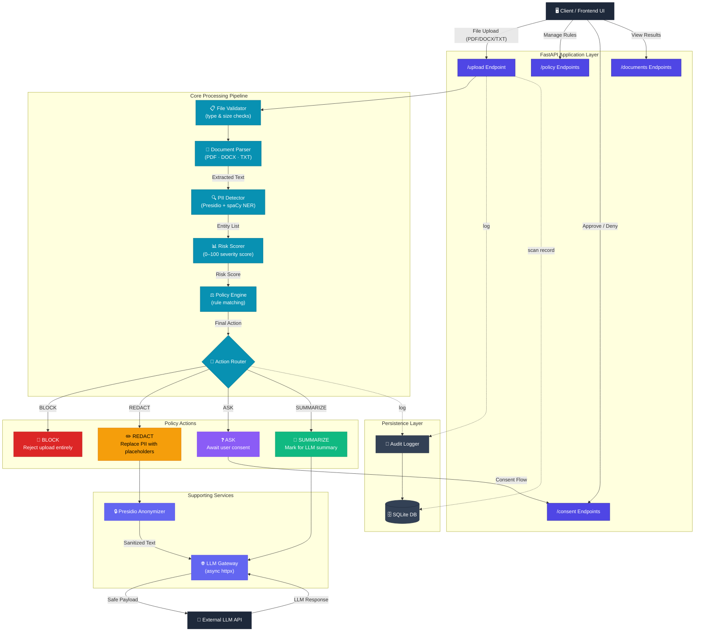

# AI Firewall for Document Uploads

> A privacy proxy that intercepts every document upload, detects sensitive data, scores risk, enforces policy rules, and decides what the Language Model is allowed to see.

## Architecture



## Features

- **5+ Entity Types Detected**: Identifies critical entities including PERSON, ORG, LOCATION, PHONE_NUMBER, and custom Indian PII like AADHAAR.
- **4 Proxy Actions**: Policy engine enforces actions based on sensitivity: **BLOCK**, **ASK** (Human-in-the-Loop), **REDACT**, and **SUMMARIZE**.
- **Risk Scoring**: Evaluates risk from 0–100 (LOW to CRITICAL) depending on the severity and count of the PII found.
- **Audit Log**: Compliance-ready logging using SQLAlchemy to track every upload, detection, action, and LLM response.
- **Document Parsing**: Seamless extraction from PDF, DOCX, and TXT files using specialized tools.

## Tech Stack

| Component | Technology | Responsibility |
| :--- | :--- | :--- |
| **Upload & Consent API** | FastAPI, Pydantic | Receives files, validates schema, handles consent flows |
| **Document Parser** | pdfplumber, python-docx | Extracts text from PDFs and DOCX files |
| **PII Detector** | presidio-analyzer, spaCy | Identifies sensitive entities (Named Entity Recognition) |
| **Risk Scorer & Policy Engine**| Python custom logic | Assigns risk scores and maps entity types to actions |
| **Redactor** | presidio-anonymizer | Replaces PII with safe placeholders |
| **LLM Gateway** | httpx (async) | Safely sends sanitized text to the LLM |
| **Database & Audit** | SQLAlchemy, SQLite | Logs all events and scan records |

## Quickstart

```bash
# 1. Clone the repository and navigate into the project
git clone https://github.com/yourusername/ai-firewall.git
cd ai-firewall

# 2. Install Python dependencies
pip install -r requirements.txt

# 3. Download the necessary spaCy model for NLP
python -m spacy download en_core_web_lg

# 4. Start the FastAPI development server
uvicorn app.main:app --reload
```

## API Docs

The interactive API documentation is automatically generated. Once the server is running, navigate to:
[http://localhost:8000/docs](http://localhost:8000/docs)

<!-- Add screenshot of /docs here -->

## Running Tests


Execute the comprehensive test suite to ensure all components and the detection engine are functioning correctly:

```bash
pytest tests/ --cov=app --cov-report=term-missing
```